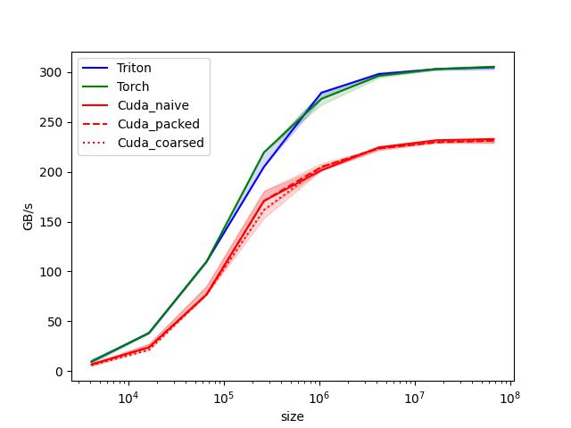

### 01.vector_add

这是最简单的一个kernel了,但是在profiling性能的时候还是遇到了问题: cuda手写kernel性能不及预期.

由于profiling用的GPU是一个显存阉割了1/4的nvidia 3070, 所以理论带宽会变成 448GB/s * 3 / 4 = 336 GB/s(数据来自[nvidia-ampere-ga-102-gpu-architecture-whitepaper page 47](https://www.nvidia.com/content/PDF/nvidia-ampere-ga-102-gpu-architecture-whitepaper-v2.pdf))

初始结果如下图



从图可以看出, triton和torch都已经达到了305GB/s的性能,基本达到理论上限的 90%, 性能基本已经达到预期了,但是cuda kernel只有230GB/s.

这我也很崩溃啊,一个性能工程师写的kernel不如编译器,所以我开始查看性能是否有可提升地方, 后来添加了packed使用float4, 使用coarsened每个线程处理多个数据,后来发现性能都无法更高.

事情的性质就变了!!

使用ncu进行profiling, Memory workload analysis统计 L2到L1带宽已经达到310GB/s, 那说明读取能力没有问题,那么性能问题可能来自处理逻辑(比如读取了没有正确使用,这种简单kernel比较难出现)或者kernel外的性能损失.

```bash
ncu --set full -o test5.profile python3 01.vector-add.py
```

由于cuda nsys不支持wsl环境下的profiling,所以手动在kernel前后使用cuda event打点,得到kernel性能,统计得到最高带宽能达到预期310GB/s. kernel性能的嫌疑排除. 并且在去掉kernel执行后,torch调用栈在triton benchmark中统计为950GB/s. 所以调用栈的归一化时间为1/950, 实际拷贝的归一化时间为1/305, 统计的带宽为1/(1/950+1/305)=230GB/s.

目前torch.cpp_extension的调用栈还不熟悉,有时间可以研究下.